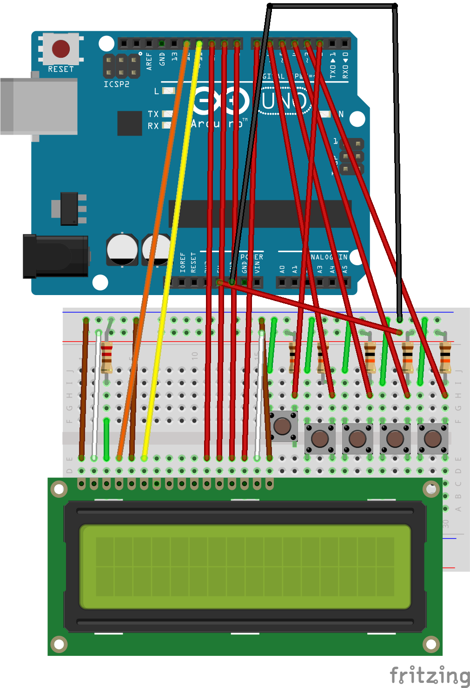

myRCLapcounter
===

What I was looking for was a simple device for counting laptimes on an rc car track.
The device should be easy to handle and there should not be things to build up on the track (e.g. sensor bridge above the track).
There was one solution that fitted my needs, the Alex Racing Hakarunjer (introduced in 2001). But you can't buy it anymore.
Duane from [rcarduino.blogspot.com](rcarduino.blogspot.com) build something similar to the Hakarunjer based on an Arduino board.
That inspired me to build my own laptimer, based on his idea and code.

Parts needed to build this setup:
[Bill of Material](LapCounterBoard_bom.html)